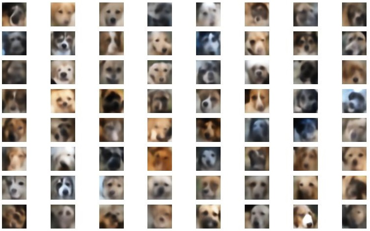

# Generative Dog Faces

## Sections
- [Download and preprocess dataset](#download-and-preprocess-dataset)
- [Implemented Models](#implemented-models)
    - [Variational Autoencoder (VAE)](#variational-autoencoder-vae)
    - [Deep Convolutional Generative Adversarial Network (DGAN)](#deep-convolutional-generative-adversarial-network-dgan)
- [Resources](#resources)

## Download and preprocess dataset:
Run `prepare_dataset.py` script to:
- download datasets:
    - [Stanford Dogs Dataset](http://vision.stanford.edu/aditya86/ImageNetDogs)
    - [Kaggle Cats and Dogs Dataset](https://www.microsoft.com/en-us/download/details.aspx?id=54765) (cats images are automatically deleted from the dataset) 
- Unzip downloaded datasets
- Merge them into one big dataset of dogs' images
- Crop faces of dogs from the images (new file is created for each detected face of a dog). Dog face detector is downloaded from github.com/kairess/dog_face_detector
- Preprocess images:
    - resize to 64x64 pixels
    - convert to torch.Tensor
- Split dataset into train, validation and test sets with ratio 90/5/5%
- Save sets as numpy ".npy" files

When running script, you have to specify destination directory, where created sets will be saved by setting `--destination` parameter. Make sure to create separate directory for that, because at the end of the script its content will be cleared, as there are many intermediate files created during preparation of the dataset.

## Implemented Models

#### Variational Autoencoder (VAE)

| Task                                                          | Command                                              | Info |
|---------------------------------------------------------------|------------------------------------------------------|------|
| hyperparameters optimization | `python optuna_search.py --model vae --n <num_trials> --dataset-path <path>`          | Uses optuna to search for best hyperparameters. Loss value is used to determine best configuration among specified number of runs. |
| train model                  | `python train_vae_model.py --dataset-path <path> --save-path <path> [--calc-mifid]`   | Loss value is used to determine and save weights of the best model, unless `--calc-mifid` parameter is passed. In that case, mifid metric is used. Mifid is calculated only for validation set in order to save time (calculating it also for train set would significantly extend training time).|
| inference                    | `python inference_vae.py --model-path <path> --save-path <path>`                      | Generates 64 random images using trained decoder and saves them to specified path. |

#### VAE results (not cherry picked)

#### Deep Convolutional Generative Adversarial Network (DGAN)

| Task                                                          | Command                                              | Info |
|---------------------------------------------------------------|------------------------------------------------------|------|
| hyperparameters optimization | `python optuna_search.py --model gan --n <num_trials> --dataset-path <path>`          | Uses optuna to search for best hyperparameters. Mifid value is used to determine best configuration among specified number of runs, since for GANs the loss value is not the best value to assess the quality of generated images. This comes with a drawback of a long training time. |
| train model                  | `python train_gan_model.py --dataset-path <path> --save-path <path>`   | Mifid value is used to determine and save weights of the best model. Mifid is calculated only for validation set in order to save time (calculating it also for train set would significantly extend training time).|
| inference                    | `python inference_gan.py --model-path <path> --save-path <path>`                      | Generates 64 random images using trained generator and saves them to specified path. |

#### DCGAN results (not cherry picked)

# Resources
- https://arxiv.org/pdf/1511.06434v2
- https://pytorch.org/tutorials/beginner/dcgan_faces_tutorial.html
- https://github.com/soumith/ganhacks
- https://arxiv.org/pdf/1312.6114